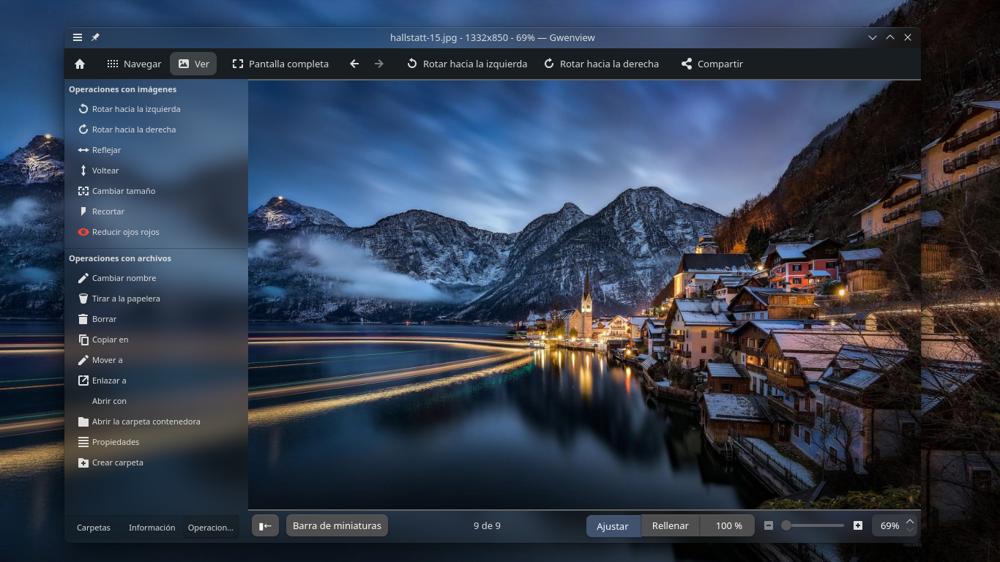
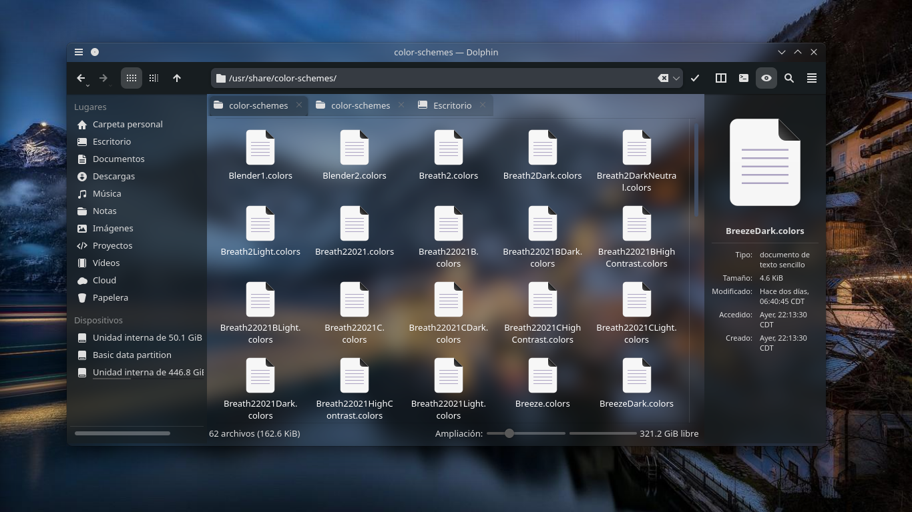
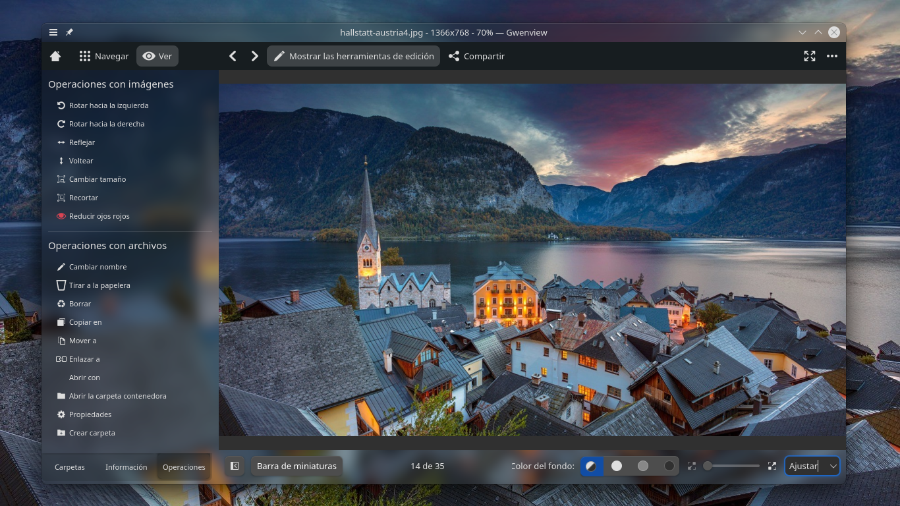
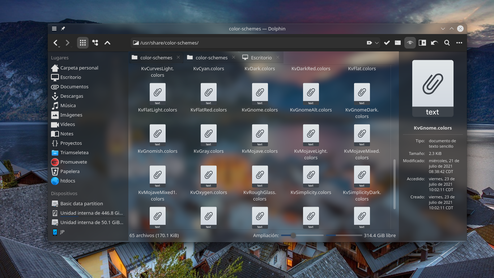

# Lightly Color Schemes

Alternative color schemes for [Lightly theme style](https://github.com/Luwx/Lightly)

## Themes

### Lightly Grey glass





### Lightly Blue glass

*Inspired in Orchis Dark*





### Lightly Blue glass


## Installation

First, install [Lightly](https://github.com/Luwx/Lightly), then copy the `.colors` file in `/usr/share/color-schemes/`.

For example, if you want to install **blue-glass** theme, go to the project directory and run:

```
sudo cp blue-glass/LyghtlyBlueGlass.colors /usr/share/color-schemes/
```

